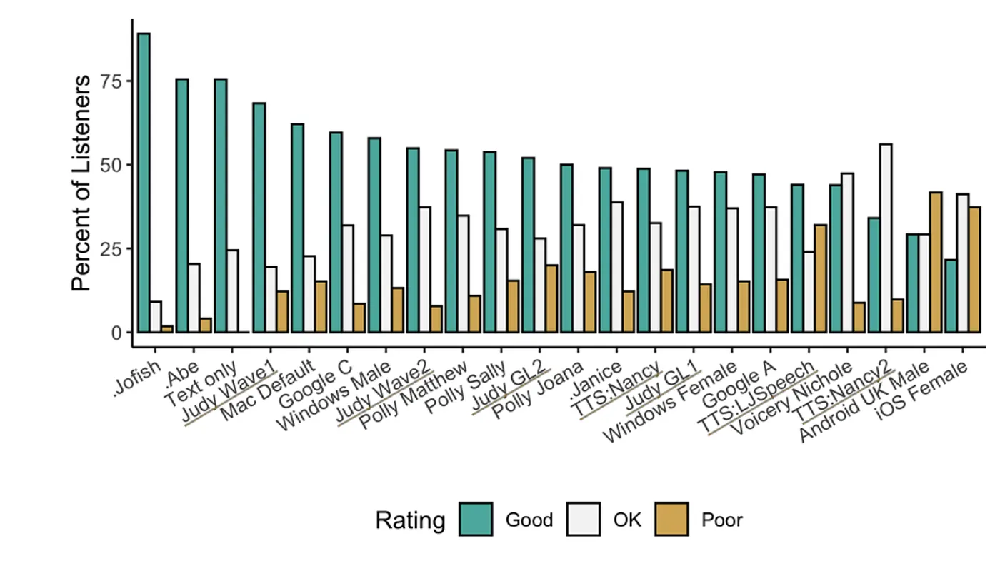
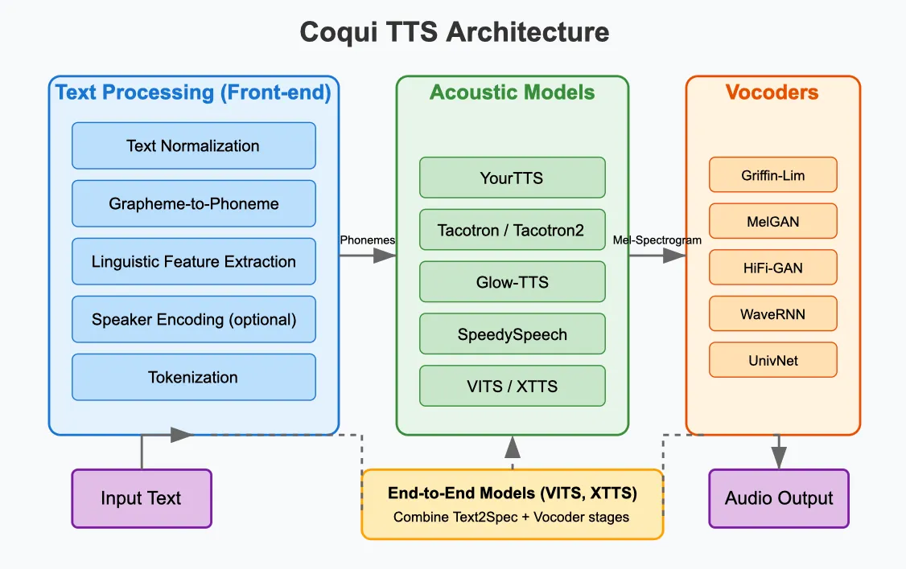
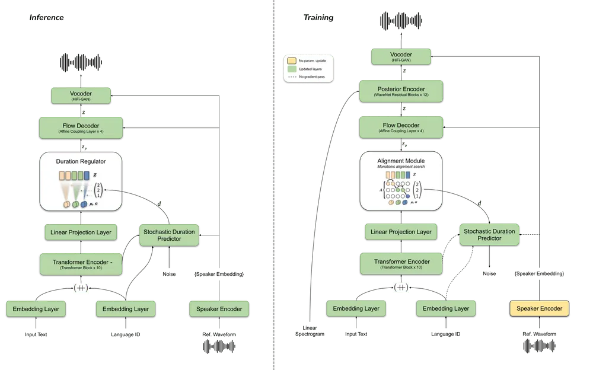

# Coqui TTS: Deep Dive into an Open-Source Text-to-Speech Framework

Coqui as a company announced its shutdown in December 2023, with services officially going offline in early 2024. Despite this organizational change, the open-source nature of the Coqui TTS project means that the technology remains freely available to developers and researchers. All previously released models and code repositories continue to be accessible on GitHub, allowing the community to use, modify, and potentially further develop these valuable speech synthesis tools.

## What is Coqui TTS?

Coqui TTS (often stylized as 🐸TTS) is an open-source deep learning toolkit for Text-to-Speech synthesis that aims to make advanced speech generation accessible to developers and researchers. Originally developed by the creators of Mozilla's TTS engine, Coqui TTS has evolved into a mature project that balances ease-of-use with cutting-edge speech synthesis capabilities.

## Purpose from an End-User Perspective
From an end-user perspective, Coqui TTS serves several key purposes:

- **High-Quality Speech Synthesis**: It generates natural-sounding speech from text inputs, supporting multiple languages and voices.
- **Voice Cloning**: With as little as 6 seconds of audio, users can clone voices and apply them to new text.
- **Cross-Language Voice Transfer**: The framework allows applying a voice from one language to text in another language.
- **Emotion and Style Transfer**: Users can transfer emotional qualities and speaking styles from reference audio.
- **Local Deployment**: Unlike many cloud-based solutions, Coqui TTS can be deployed locally, ensuring privacy and reducing latency.

The ML component of Coqui TTS represents a significant advancement in speech synthesis. Traditional TTS systems often produced robotic-sounding speech and required extensive rule-based systems. In contrast, Coqui TTS leverages deep learning models that can capture the nuances of human speech, including intonation, rhythm, and pronunciation variations.

### Real-World Application Example (my experience as an end-user)
I tested Coqui TTS by implementing it in a small prototype application that generates audio narrations for short sentences. The process involved processing text through sentence normalization, then passing it to the YourTTS model for voice synthesis with a custom voice sample (voice cloning feature). The most impressive aspect was how the model maintained natural prosody across sentence boundaries, making even longer sentences sound cohesive. This practical application demonstrated why Coqui TTS is valuable for content creators who need customized voice-overs without professional recording equipment.

During this testing, I also discovered that the model’s behavior varies significantly depending on the input length. For shorter texts (under 100 words), YourTTS produced remarkably natural speech with consistent prosody. However, when processing longer texts, I found the `split_sentences` parameter in the API crucial for maintaining natural-sounding speech across sentence boundaries. This parameter enables the system to process text in manageable chunks that align with natural speech patterns.

One particularly impressive aspect was voice cloning with minimal data. With just a 7-second audio sample, YourTTS managed to capture fundamental voice characteristics like timbre and speech rate, though certain phonetic nuances required longer samples (30+ seconds) to reproduce accurately. This practical experience demonstrated why Coqui TTS is valuable for content creators and developers who need customized voice output without professional recording equipment.

## Architectural Structure: How Coqui TTS Works
Coqui TTS's architecture is modular and well-organized, allowing for flexibility in both use and development. It allows the use of multiple models which can be explored upon installation. Let's break down its key components:

### High-Level Architecture

The overall architecture of Coqui TTS can be divided into several key components:

1. **Text Processing Frontend**: Converts raw text into phonetic or character representations
2. **Acoustic Models (Text2Spec)**: Transforms processed text into spectrograms
3. **Vocoders**: Converts spectrograms (visual representations of sound frequencies) into waveforms (actual audio that can be played)
4. **Speaker Encoders**: For multi-speaker models, encodes speaker characteristics
5. **Training Infrastructure**: Manages model training, validation, and evaluation
6. **Inference API**: Provides interfaces for model deployment and use

*Modular Architecture of Coqui TTS. The diagram illustrates the three main components of the Coqui TTS pipeline: (1) Text Processing Front-end, which handles normalization, phoneme conversion, and linguistic feature extraction; (2) Acoustic Models, with YourTTS leading several options that convert text to spectrograms; and (3) Vocoders, which transform spectrograms into audible speech. The solid arrows show the traditional pipeline flow, while dashed lines represent the alternative path taken by end-to-end models like VITS and XTTS that combine the latter two stages into a single process.*

### ML Components
The core of Coqui TTS lies in its ML models, which include:

#### Text2Spec Models

- **YourTTS**: A Zero-Shot Multi-Speaker TTS and Zero-Shot Voice Conversion for everyone that has Multi-Lingual TTS, Multi-Speaker TTS, Zero-Shot learning, Speaker/language adaptation, Cross-language voice transfer, Zero-shot voice conversion capabilities.
- **Tacotron & Tacotron2**: Sequence-to-sequence models with attention mechanisms
- **Glow-TTS**: Non-autoregressive model based on normalizing flows
- **SpeedySpeech**: Faster, non-autoregressive model for improved inference speed
- **VITS**: End-to-end model that integrates vocoding
- **XTTS**: Advanced multilingual model supporting 17 languages and voice cloning

#### Vocoder Models

- **MelGAN & Multiband-MelGAN**: GAN-based vocoders for fast synthesis
- **HiFiGAN**: Higher quality GAN-based vocoder
- **WaveRNN**: RNN-based vocoder with good quality but slower inference
- **UnivNet**: Universal vocoder that works across different speakers

#### Speaker Encoders

- **GE2E**: Speaker verification model that extracts speaker embeddings
- **Angular Loss**: Alternative speaker encoder that focuses on discriminating between speakers

### Non-ML Components
The non-ML parts of Coqui TTS are equally important for creating a complete, usable system:

- **CLI Interface**: Provides command-line tools for synthesis, training, and evaluation
- **Server Component**: Offers a web interface for interactive use
- **Python API**: Enables programmatic access to all functionality
- **Dataset Utilities**: Tools for curating and preprocessing TTS datasets
- **Configuration System**: Manages model and training parameters
- **Audio Processing**: Handles audio feature extraction and manipulation

### How ML and Non-ML Components Interact

1. The configuration system defines the parameters for models and training
2. Dataset utilities prepare data for training or evaluation
3. Audio processing converts raw audio into features for training
4. CLI/API interfaces provide user access to the underlying models
5. During inference, text processing prepares input for ML models
6. ML models generate spectrograms from processed text
7. Vocoders convert spectrograms to audio
8. Server/API components deliver the final output to users

The interaction between ML and non-ML components in Coqui TTS is seamless:

- **Text Processing**: Non-ML text cleaners (`cleaners.py`) normalize text before passing to ML models. They handle abbreviations, numbers, and punctuation.
- **Sentence Splitting**: Non-ML regex-based functions in `synthesizer.py` break long text into manageable chunks for the ML models to process.
- **Tokenization**: The tokenizer converts text to numerical IDs, bridging text processing (non-ML) and neural network input (ML).
- **Parameter Validation**: Non-ML validation logic in `api.py` ensures inputs are compatible with model requirements before ML processing begins.
- **Audio Processing**: Signal processing functions handle audio conversions between different sampling rates and formats before/after ML processing.
- **Error Handling**: Traditional programming techniques detect ML model failures and implement fallback strategies.
- **Memory Management**: Non-ML code manages GPU memory allocation and batching to optimize ML model performance.

This architecture allows specialized components to handle their respective tasks while maintaining clear interfaces between traditional programming and neural network components.

## Engineering Insights and Design Decisions

### Design for Quality and Performance
Coqui TTS makes clear design choices to ensure high-quality speech generation:

- **Model Variety**: By supporting multiple model architectures, Coqui TTS allows users to choose the best trade-off between speed and quality for their application.
- **Dynamic Vocoder Selection**: The `synthesizer.py` implementation allows for runtime selection of different vocoders based on quality and speed requirements. This architecture pattern reflects a key engineering decision: separating the text-to-spectrogram and spectrogram-to-waveform processes allows users to choose different quality-speed tradeoffs at deployment time without retraining models.
- **Attention Mechanisms**: Various attention methods (like Forward Backward Decoding and Dynamic Convolutional Attention) address common issues in speech synthesis like word skipping or repetition.

### Pipeline and Automation Decisions
The project demonstrates thoughtful pipeline design:

- **Modular Training Pipeline**: The trainer API abstracts away common training functionality, making it easier to implement and test new models.
- **Tensorboard Integration**: Detailed logging facilitates model development and debugging.
- **Multi-GPU Support**: Looking at training configurations, I found that the system automatically adapts batch sizes based on available GPU memory. For instance, in the training scripts for YourTTS, the system calculates appropriate batch sizes to prevent CUDA out-of-memory errors while still maintaining effective training. The `gradually_start_training` parameter in config files shows how reduction rates and batch sizes can be incrementally adjusted during training to optimize resource usage.
- **Automated Evaluation**: Built-in metrics help assess model quality throughout training.

### Deployment Considerations
Coqui TTS offers several deployment options:

- **PyPI Package**: Simple installation for end-users primarily interested in synthesis.
- **Docker Images**: Containerized deployment for consistent environments.
- **Web Server**: A built-in server component for interactive use.
- **Command-Line Interface**: Direct access to functionality without programming.
- **Python API**: Programmatic integration into larger applications.

These options make Coqui TTS adaptable to various use cases, from research to production.

### Human-AI Interaction Design
The project considers several aspects of human-AI interaction:

- **Voice Customization**: Multiple speaker support and voice cloning enable personalized experiences.
- **Server Interface**: The web interface provides an accessible way to interact with models.
- **Progressive Enhancement**: The ability to use basic models on lower-end hardware ensures broader accessibility.
- **Multi-language Support**: Internationalization extends the tool's reach beyond English-speaking users.

### Error Handling and Mistake Management
Coqui TTS incorporates several approaches to handle the inevitable errors in speech synthesis:

- **Attention Alignment Mechanisms**: Coqui TTS implements multiple attention mechanisms to address common TTS issues. For example, examining the codebase shows that the Double Decoder Consistency (DDC) approach uses two decoders with different reduction factors learning synchronously. The coarse decoder (with higher reduction factor) provides stable attention alignment, while the fine decoder captures more detailed acoustic features. This dual-decoder approach allows for faster training convergence while maintaining high-quality output.
- **Phoneme-Based Processing**: Converting text to phonemes first can improve pronunciation accuracy.
- **Configurable Parameters**: Settings like temperature allow controlling the trade-off between consistency and naturalness.
- **Model Checkpointing**: Saving models at regular intervals prevents complete loss of training progress.

A fascinating engineering detail is in how models recover from synthesis errors. When generating speech for long texts, the system splits content into manageable sentences and includes mechanisms to retry generation with different parameters if initial attempts fail. Looking at the server implementation, I noticed how these retry mechanisms are built into the production pipeline to ensure robustness.

### Collaborative Development
Examining the commit history and issue tracker reveals how Coqui TTS evolved through community collaboration:

- **Backwards Compatibility**: The project maintains careful version tracking (in `version.py`) to ensure that models trained with older versions remain compatible with newer code releases.
- **Reproducibility**: Each model implementation includes detailed training configurations and hyperparameters in separate config files, allowing researchers to reproduce results exactly.
- **Contribution Workflow**: The project uses a structured PR template that requires contributors to address model performance, documentation, and test coverage for each change, maintaining high code quality despite many contributors.
- **Issue Prioritization**: The team uses GitHub labels effectively to triage issues between bugs, feature requests, and documentation needs, creating a clear roadmap for ongoing development. This structured development process has helped Coqui TTS remain stable and usable despite its complex ML components and the recent shutdown of the original company.
- **Clear Contribution Guidelines**: Documentation helps new contributors understand how to participate.
- **Modular Codebase**: The separation of components allows developers to focus on specific areas.
- **Extensive Documentation**: Guides for implementing new models, datasets, and features lower the barrier to entry.

## Reference
https://medium.com/@sudeshnm/coqui-tts-deep-dive-into-an-open-source-text-to-speech-framework-129c76a66580